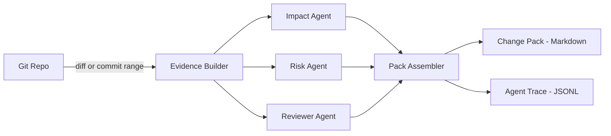

# AgenticChangeScribe

**AgenticChangeScribe** is an **agentic AI** tool that turns a Git change (diff/commit range) into a high‑signal **Change Pack**:
- **What changed** (plain English)
- **Impact analysis** (systems/users/contracts)
- **Risk assessment** + suggested mitigations
- **Test plan** (what to run / what to verify)
- **Rollback notes**

It is designed as a **portfolio‑grade reference implementation** for “agentic workflows” in real engineering: multiple specialized agents that **analyze**, **cross‑check**, and **produce structured deliverables**—not just chat.

> Works with any **OpenAI-compatible** API endpoint (OpenAI, Azure OpenAI, LiteLLM, etc.).

---

## Why this is “agentic” (not just an LLM wrapper)

Most tools call an LLM once and print text. AgenticChangeScribe uses **3 cooperating agents** with distinct roles:

- **Impact Agent** → maps changes to affected modules/interfaces and expected user/system impact  
- **Risk Agent** → looks for failure modes, security/compliance pitfalls, and operational risks  
- **Reviewer Agent** → critiques the draft pack, points out missing evidence, and improves clarity  

Each agent sees the same evidence (diff + optional metadata), produces its own output, and the system **merges** results into a cohesive Change Pack. A full **agent trace** is stored for auditability.

---

## What it’s for

Recruiter-friendly examples:

- **PR descriptions** that don’t miss impact/risk/test details
- **Release notes** for internal stakeholders
- **Change control** documents for regulated environments
- **Peer review support** (a “second set of eyes” on risky diffs)

---

## Quick demo

Run against any Git repo (mounted into the container):

```bash
export LLM_BASE_URL="https://YOUR-ENDPOINT"
export LLM_API_KEY="YOUR_KEY"
export LLM_MODEL="gpt-4.1-mini"

export REPO_PATH="/absolute/path/to/your-repo"

docker run --rm   -e LLM_BASE_URL -e LLM_API_KEY -e LLM_MODEL   -v "$REPO_PATH":/repo   -v "$REPO_PATH/docs/change-packs":/out   -w /repo   agentic-changescribe:latest   generate --repo /repo --diff auto --outdir /out   --title "Change title"   --summary "Short summary"
```

Output is written to: `docs/change-packs/<timestamp>/` (or your `--outdir`)

Typical files:
- `CHANGE_SUMMARY.md`
- `IMPACT.md`
- `RISKS.md`
- `TEST_PLAN.md`
- `ROLLBACK.md`
- `agent-trace.jsonl`

## Example output (what reviewers see)

### 1) Change summary (excerpt)
```md
# Change Summary
Title: Add retry + timeout around payments provider call

What changed:
- Introduced a bounded retry (max 3) for transient provider errors
- Added a request timeout and standardized error mapping
- Refactored provider client into a separate module for testability

Why:
- Reduce flaky failures caused by intermittent provider latency
- Make error handling consistent across services
```

### 2) Risks (excerpt)
```md
## Key risks
- Retry can amplify load during partial outages (risk of thundering herd)
  Mitigation: exponential backoff + jitter; circuit-breaker recommendation.
- Timeout changes may surface previously masked latency issues
  Mitigation: monitor p95/p99; adjust per endpoint SLO.
- Behavior change for specific error codes
  Mitigation: add contract tests + rollout with canary.
```

### 3) Test plan (excerpt)
```md
## Suggested validation
- Unit: provider client maps error codes correctly
- Integration: simulate provider 5xx and verify bounded retry
- E2E: payment flow succeeds under injected latency (timeout boundary)
- Observability: confirm new metrics/log fields appear in dashboards
```

> These are examples of the **format**. Real output is generated from your repo diff and the evidence available.

---

## Before/After: PR description upgrade

### Before (typical)
> Fixed some failures in payment service. Refactoring included.

### After (generated Change Pack summary)
```md
## What
Added bounded retry + timeout handling around the payments provider client and standardized error mapping.

## Why
Reduce flaky failures due to intermittent provider latency and make error behavior consistent across services.

## Impact
- Payment service: provider client behavior changes for transient failures
- Ops: new metrics/log fields for retries/timeouts
- No schema changes

## Risks
- Retry load amplification during outages → mitigate with backoff/jitter (recommended)
- Timeout boundary changes → monitor p95/p99; canary rollout

## Test plan
- Unit tests for error mapping
- Integration tests simulating 5xx/latency
- E2E payment flow validation
```

---

## Architecture




---

## Installation (local)

```bash
python -m venv .venv
source .venv/bin/activate
pip install -e .
```

Run:
```bash
export LLM_BASE_URL="https://YOUR-ENDPOINT"
export LLM_API_KEY="YOUR_KEY"
export LLM_MODEL="gpt-4.1-mini"

agentic-scribe generate --repo . --diff auto --title "..." --summary "..."
```

---

## Docker

### Build
```bash
docker build -t agentic-changescribe:latest .
```

### Compose (optional)
Create a `.env` next to `docker-compose.yml`:
```bash
LLM_BASE_URL=...
LLM_API_KEY=...
LLM_MODEL=...
REPO_PATH=/absolute/path/to/your-repo
OUT_PATH=/absolute/path/to/your-repo/docs/change-packs
```

Then run:
```bash
docker compose run --rm agentic-scribe
```

---

## Configuration

Environment variables:
- `LLM_BASE_URL` (required) — OpenAI-compatible base URL
- `LLM_API_KEY` (required)
- `LLM_MODEL` (required)
- `LLM_TIMEOUT_S` (optional, default: 60)
- `LLM_TEMPERATURE` (optional, default: 0.2)

---

## CLI commands

- `agentic-scribe generate` — generate a Change Pack from a repo diff

Common flags:
- `--repo PATH` — target git repo
- `--diff auto|range` — auto selects unstaged/staged/HEAD; or pass a commit range (implementation dependent)
- `--title TEXT` — change title
- `--summary TEXT` — short intent summary (helps steer the pack)
- `--outdir PATH` — output directory

---

## Design choices (what reviewers usually care about)

- **Traceability:** every agent’s intermediate output is stored in `agent-trace.jsonl`
- **Separation of concerns:** agents are isolated classes; adding a new agent is straightforward
- **Safe-by-default:** no code execution; only reads `git diff` and writes markdown artifacts  
  (you can add test execution later as an optional “evidence source”)

---

## Roadmap ideas (easy next steps)

- **Evidence adapters:** Jira ticket context (read-only), CI logs, test output, static analysis results
- **PR bot mode:** GitHub Action that posts Change Pack summary as a PR comment
- **Policy packs:** bank/regulatory templates (e.g., “PCI impact checklist”, “data classification prompts”)

---

## Disclaimer

This project is a **demo/portfolio artifact**. Always review AI outputs before using them in production or regulated environments.
